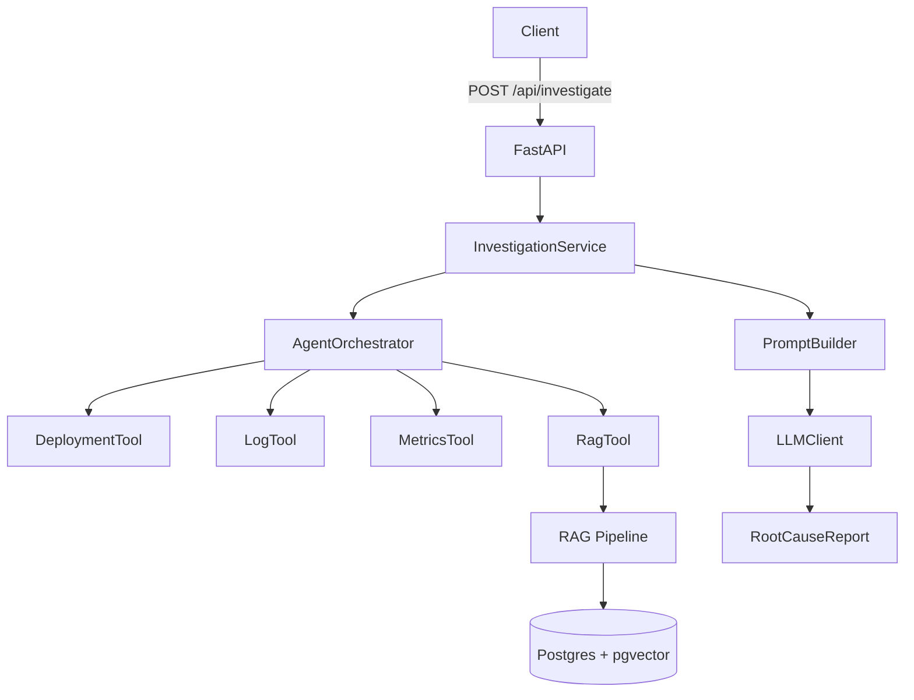

# AI Incident Investigation Assistant

Backend service that investigates incidents by orchestrating tools for logs, metrics, deployments, and internal documentation, then producing a structured root-cause report via an LLM (or a dummy mode for offline use).

## What It Does

- Accepts an investigation request with a query, optional service, and optional time window.
- Runs an agent plan that calls tools for deployments, logs, metrics, and RAG.
- Builds a prompt from gathered evidence and generates a `RootCauseReport`.
- Exposes a health endpoint for basic availability checks.

## Architecture At A Glance



## Quick Start (Local)

```bash
cp .env.example .env
pip install -r requirements.txt -r requirements-dev.txt
make dev
```

API will be available at `http://localhost:8000`.

## Run With Docker

```bash
docker-compose up --build
```

This starts the API and a Postgres instance with `pgvector` enabled.

## Seed Example RAG Documents

```bash
python scripts/seed_data.py
```

This seeds a few mock runbook/postmortem docs into `rag_documents`.

## API

### POST `/api/investigate`

Request body:

```json
{
  "query": "Why did upload requests fail?",
  "service": "incident-upload-service",
  "start_time": "2025-01-01T00:00:00Z",
  "end_time": "2025-01-01T02:00:00Z"
}
```

Response body:

```json
{
  "primary_cause": "...",
  "contributing_factors": ["..."],
  "timeline": ["..."],
  "evidence": ["..."],
  "confidence": 0.42,
  "next_steps": ["..."]
}
```

Health check:

- `GET /health`

## Configuration

These are read from `.env` (see `.env.example`).

- `APP_ENV`
- `APP_HOST`
- `APP_PORT`
- `LOG_LEVEL`
- `DATABASE_URL`
- `OTEL_SERVICE_NAME`
- `OTEL_EXPORTER_OTLP_ENDPOINT`
- `LLM_PROVIDER`
- `LLM_MODEL`
- `OPENAI_API_KEY`
- `GROQ_API_KEY`
- `LLM_DUMMY`

Notes:

- Set `LLM_DUMMY=true` to avoid external LLM calls and return a placeholder report.
- Set `LLM_PROVIDER=groq` and `GROQ_API_KEY=...` to use Groq via its OpenAI-compatible API.
- `DATABASE_URL` must point to Postgres with `pgvector` available.

## Project Structure

- `app/api/` HTTP endpoints
- `app/services/` orchestration and business logic
- `app/agent/` agent plan and graph
- `app/tools/` tool adapters (logs, metrics, deployments, RAG)
- `app/rag/` ingestion and retrieval pipeline
- `app/llm/` prompt building and LLM client
- `app/db/` database clients
- `app/models/` request/response schemas
- `app/domain/` domain entities
- `app/telemetry/` logging setup
- `scripts/` helper scripts
- `tests/` test suite
- `docs/` design docs

## Testing

```bash
PYTHONPATH=. pytest -q
```

## Docs

- `docs/ARCHITECTURE.md`
- `docs/DECISIONS.md`
- `docs/ROADMAP.md`
- `docs/HLD.md`
- `docs/LLD.md`

## License

MIT
