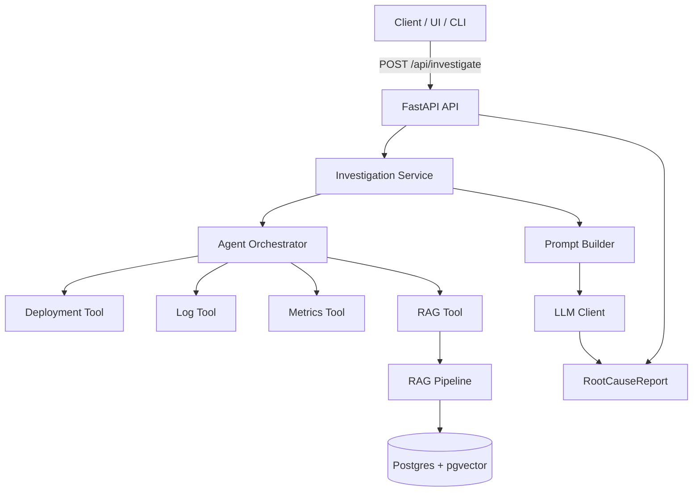

# High-Level Design (HLD)

## Goals

- Provide a single API for incident investigation and root-cause reporting.
- Orchestrate multiple evidence sources (logs, metrics, deployments, docs).
- Keep the system easy to run locally and in a single container stack.
- Allow incremental evolution of tools and retrieval without changing the API.

## Non-Goals

- Full production-grade observability pipeline in this version.
- Multi-tenant auth and fine-grained access control.
- Real-time streaming analysis.

## System Context

The system sits behind a client (CLI, UI, or another service). It retrieves operational evidence from Postgres/pgvector and returns a structured report. The LLM is optional, with a dummy mode for offline operation.

## Logical Components

- API Layer
- Investigation Service
- Agent Orchestrator
- Tool Adapters
- RAG Pipeline
- LLM Client
- Data Stores
- Telemetry

## Component Responsibilities

### API Layer

- Exposes `POST /api/investigate` and `GET /health`.
- Validates request/response schemas.

### Investigation Service

- Builds investigation state from the request.
- Invokes the agent orchestrator.
- Builds the final prompt and calls the LLM.

### Agent Orchestrator

- Determines the execution plan (currently a fixed sequence).
- Executes tools in order and accumulates evidence.
- Maintains tool history in the investigation state.

### Tool Adapters

- DeploymentTool, LogTool, MetricsTool, RagTool.
- Each tool enriches the investigation state with evidence.

### RAG Pipeline

- Embeds the query.
- Searches vectors in Postgres `pgvector`.
- Builds a context string from top-k results.

### LLM Client

- Produces a `RootCauseReport` using a JSON schema response format.
- Supports a dummy response when disabled.

### Data Stores

- Postgres for operational data and RAG documents.
- `pgvector` for embedding search.

### Telemetry

- Structlog logging with JSON output.
- OpenTelemetry configuration placeholders.

## Data Flow

### Investigation Request

1. Client calls `POST /api/investigate`.
2. `InvestigationService` constructs `InvestigationState`.
3. Agent executes tools in order and aggregates evidence.
4. `PromptBuilder` generates an LLM prompt.
5. `LLMClient` returns `RootCauseReport`.
6. API returns the report to the client.

### RAG Ingestion

1. Documents are loaded and chunked.
2. Each chunk is embedded.
3. Embeddings and metadata are stored in Postgres `rag_documents`.

## HLD Diagram

## Deployment View

- `docker-compose` runs two services: `api` and `db`.
- API container exposes port `8000` and connects to Postgres via `DATABASE_URL`.
- Postgres container uses the `pgvector/pgvector` image.

## Quality Attributes

- Simplicity: single codebase, single DB.
- Extensibility: tools and planner can be evolved without changing API.
- Testability: local dummy mode avoids external LLM calls.
- Reliability: schema initialization is idempotent for RAG tables.

## Key Risks And Mitigations

- LLM availability: dummy mode for offline work.
- Vector index performance: uses `ivfflat`, can tune `lists` later.
- Tool coverage: current tool implementations are placeholders.

## Future Enhancements

- Real data integrations for logs, metrics, deployments.
- Planner that adapts tool order based on request context.
- RAG ingestion pipelines with real embeddings and source connectors.
- Auth and multi-tenant controls for production use.
