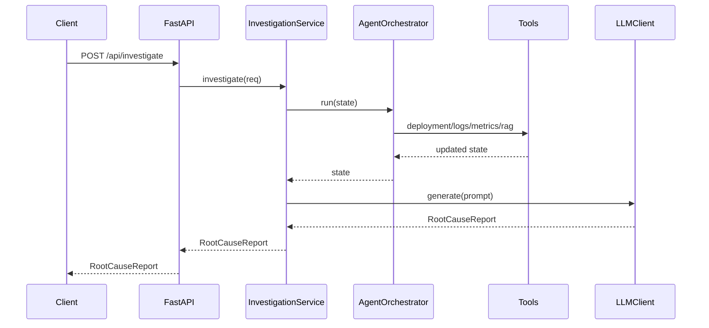
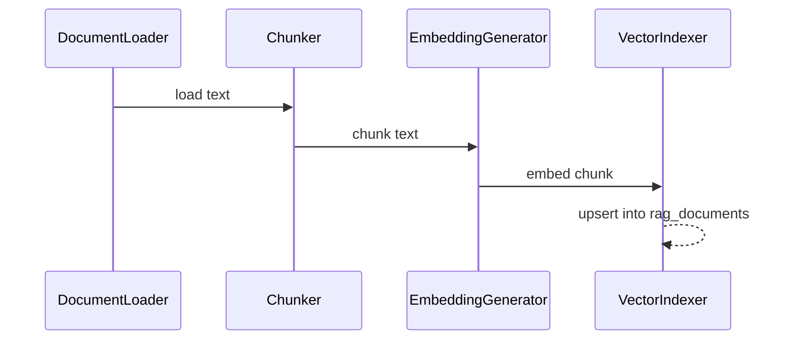

# Low-Level Design (LLD)

## Module Overview

- `app/main.py` creates the FastAPI app and registers routes.
- `app/api/investigation_api.py` defines the `/api/investigate` endpoint.
- `app/services/investigation_service.py` coordinates the investigation workflow.
- `app/agent/*` defines planning and orchestration with a LangGraph state graph.
- `app/tools/*` provides tool implementations.
- `app/rag/*` provides ingestion and retrieval for RAG.
- `app/llm/*` builds prompts and calls the LLM.
- `app/db/*` provides async database engines.
- `app/models/*` defines request and response schemas.
- `app/domain/*` defines domain entities like `Evidence`.
- `app/config/*` handles settings and environment loading.
- `app/telemetry/*` configures logging.

## API Layer

### `app/api/investigation_api.py`

- `router = APIRouter()`.
- `POST /investigate` accepts `InvestigationRequest` and returns `RootCauseReport`.
- Calls `InvestigationService.investigate` asynchronously.

## Services

### `app/services/investigation_service.py`

- Initializes `AgentOrchestrator`, `PromptBuilder`, and `LLMClient`.
- `investigate(req)` flow:
1. Build `InvestigationState` with `query`, `service`, and `time_window`.
2. Call `AgentOrchestrator.run` to enrich evidence.
3. Build prompt from state.
4. Call `LLMClient.generate` and return `RootCauseReport`.

## Agent Orchestration

### `app/agent/planner.py`

- `plan(state) -> list[str]` returns a fixed sequence: `deployment`, `logs`, `metrics`, `rag`.

### `app/agent/state.py`

Fields on `InvestigationState`:

- `query: str`
- `service: str | None`
- `time_window: tuple[str | None, str | None]`
- `evidence: list[Evidence]`
- `tool_history: list[str]`
- `hypotheses: list[str]`
- `confidence: float`

### `app/agent/agent_graph.py`

- Uses `langgraph.StateGraph` with a single node `orchestrate`.
- `orchestrate` executes tools in sequence and appends tool names to `tool_history`.
- The compiled graph returns the updated `InvestigationState`.

## Tools

### `app/tools/deployment_tool.py`

- Placeholder implementation that appends deployment evidence.

### `app/tools/log_tool.py`

- Placeholder implementation that appends log evidence.

### `app/tools/metrics_tool.py`

- Placeholder implementation that appends metrics evidence.

### `app/tools/rag_tool.py`

- Runs `RagPipeline` and adds the resulting context as evidence.

## RAG

### Ingestion

- `DocumentLoader.load(path) -> str`
- `Chunker.chunk(text, size=600, overlap=80) -> list[str]`
- `EmbeddingGenerator.embed(text) -> list[float]` uses SHA-256 for deterministic local embeddings.
- `VectorIndexer.upsert(...)` inserts chunks into `rag_documents`.

### Retrieval

- `QueryEmbedder.embed(query) -> list[float]`
- `VectorSearch.search(embedding, k=5) -> list[dict]`
- `ContextBuilder.build(chunks) -> str`
- `RagPipeline.run(query)` wires embedder, search, and context builder.

### Schema

`ensure_rag_schema()` creates `rag_documents` and the `ivfflat` index.

- `id uuid PK`
- `doc_id text`
- `chunk_index int`
- `content text`
- `metadata jsonb`
- `embedding vector(dim)`
- `created_at timestamptz`

## LLM Integration

### `app/llm/prompt_builder.py`

- `build(state)` formats evidence into a prompt for the LLM.

### `app/llm/llm_client.py`

- Uses `AsyncOpenAI` when `LLM_PROVIDER=openai` and `LLM_DUMMY=false`.
- Calls `chat.completions.create` with a `json_schema` response format.
- Parses JSON into `RootCauseReport`.
- Returns a dummy report when LLM is disabled.

## Database Access

- `app/db/postgres_client.py` provides a singleton async engine.
- `app/db/vector_client.py` reuses the same engine for vector queries.

## Configuration

### `app/config/settings.py`

- `Settings` loads environment variables from `.env`.
- Includes DB URL, LLM settings, and OTEL settings.

## Observability

- `app/telemetry/logging.py` configures `structlog` JSON logging.

## Sequence Diagrams

### Investigation Flow

### RAG Ingestion

## Open TODOs In Code

- Tool implementations currently return placeholder evidence.
- Vector DB adapter for non-Postgres backends is not implemented.
- LLM response parsing could log invalid payloads for debugging.
